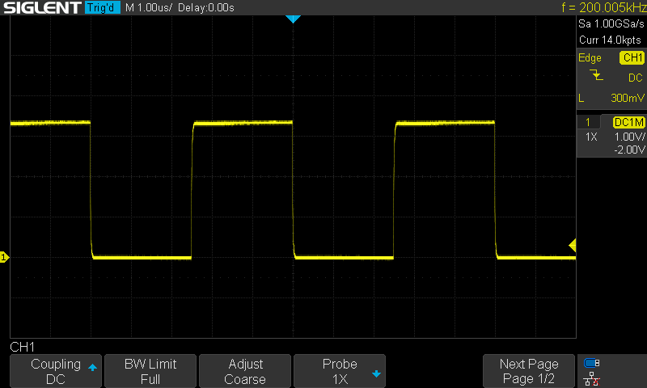
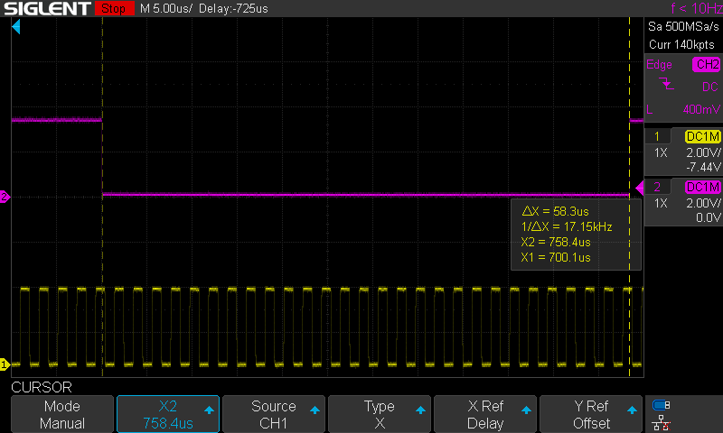
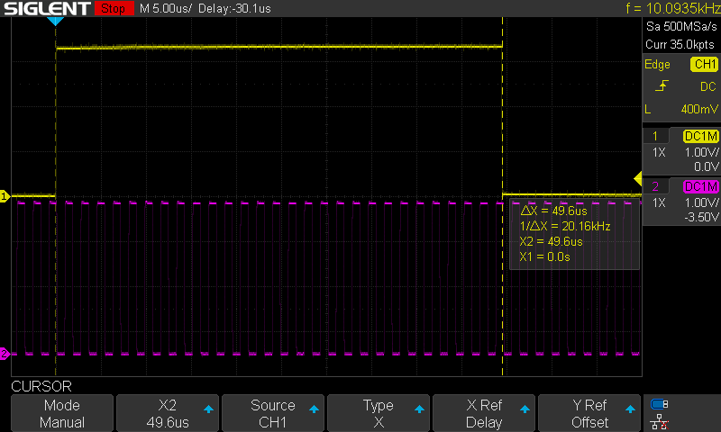
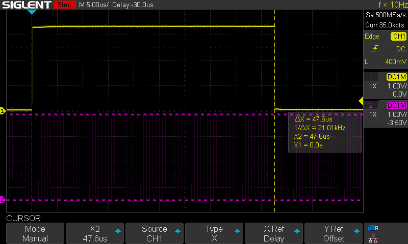
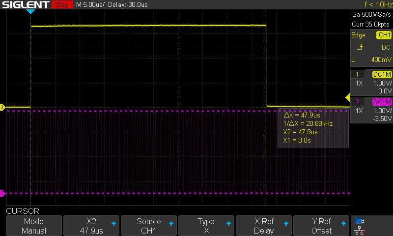
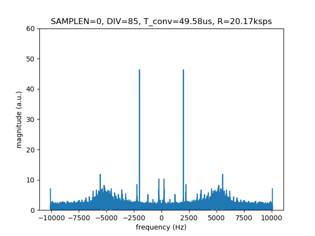
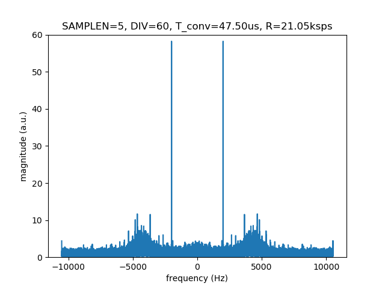
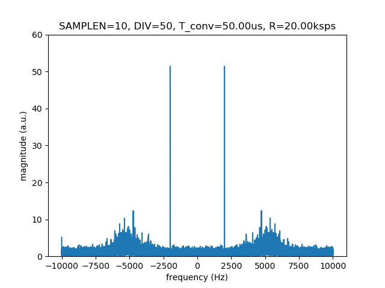

# Accelerometer

## Overview

Using the on-chip ADC for a SAMD21 microcontroller, record and transfer readings from a high-bandwidth accelerometer (ADXL-100x).

### SAMD21 ADC Characteristics

* 350ksps
* 12-bit resolution
* single-ended or differential

## Design

To maximize throughput, the ADC should be operated in free-running mode. In this mode, each conversion can be completed in 6 clock cycles, and the maximum clock frequency for the ADC is 2.1MHz (2100kHz). The clock for the ADC peripheral is provided by the SAMD21's generic clock controller (GCLK). This must be configured first.

### SAMD21 Clock System

Reference: https://blog.thea.codes/understanding-the-sam-d21-clocks/

* When connected to USB, the system clock is synchronized to the USB 1kHz frame start message, giving an accurate 48MHz clock in DFLL mode.
* Create a peripheral clock on GCLK5 using the 48MHz DFLL clock as a source
* GCLKs can be configured with a divider to scale the output frequency: an 8-bit DIV field is set in the GENDIV register
* There are two clock divider modes that can be configured for a GCLK using the DIVSEL field of the GENDIV register
  * DIVSEL=0: direct scaling with DIV cycles of the source clock equivalent to one ouput cycle from the GCLK (DIV=0 or 1 is equivalent to passing the source clock)
  * DIVSEL=1: DIV is interpreted in powers of 2 to scale the source clock. **Maximum value for DIV seems to be limited to 8 in this case?**

When initializing a GCLK, disable the GCLK first by clearing the enable flag in GENCTRL and CLKCTRL 

* GENCTRL controls clock generation
* CLKCTRL controls generated clock distribution

```c
#define GCLK_ID 5

GCLK->GENCTRL.reg = GCLK_GENCTRL_SRC_DFLL48M | GCLK_GENCTRL_ID(GCLK_ID);  // disable
GCLK->CLKCTRL.reg = GCLK_GENCTRL_ID(GCLK_ID);  //disable
while (GCLK->STATUS.bit.SYNCBUSY);
```

##### Clock Division Example 1

* Input clock frequency: 48MHz
* DIV = 240, DIVSEL = 0 (direct)
* Output clock frequency = 48MHz/240 = 200kHz

##### Clock Division Example 2

* Input clock frequency: 48MHz
* DIV = 8, DIVSEL = 1 (pow2)
* Output clock frequency = 48MHz/512 = (48000000 >> (8+1)) = 93.75kHz

```c
uint32_t reg_val = GCLK_GENCTRL_GENEN | GCLK_GENCTRL_SRC_DFLL48M | GCLK_GENCTRL_ID(GCLK_ID);
if (clk_divsel == GCLK_DIVSEL_POW2) {
  reg_val |= GCLK_GENCTRL_DIVSEL;
}
if (en_gclk_io) {
  reg_val |= GCLK_GENCTRL_OE;
} 
GCLK->GENCTRL.reg = reg_val;    
while (GCLK->STATUS.bit.SYNCBUSY);  
```

#### GCLK Output to Pin

The GCLK can be output to pin, which is useful to test on an oscilloscope. This requires

* The output enable (OE) flag be set in the GENCTRL register (see conditional on  `en_gclk_io`  in the code above)
* The pin be configured for output using the SAMD21's port multiplexing. This requires knowing which IO pin (not the physical pin) to target and selecting the correct peripheral multiplexing type (H for GCLK)

 ##### GCLK Output Example

Using PA11 as the target (Arduino pin 8/SCK on the Adafruit QT Py board).

```c
int const iopin = 11;
PORT->Group[PORTA].DIRSET.reg = (1 << iopin);     // output PA11
PORT->Group[PORTA].PINCFG[iopin].bit.PMUXEN = 1;  // enable peripheral mux 
PORT->Group[PORTA].PMUX[iopin >> 1].reg = PORT_PMUX_PMUXE_H | PORT_PMUX_PMUXO_H;  // type H
```

In the code block from the previous section, the `GCLK_GENCTRL_OE` flag is set to enable output when configuring the GCLK. This generates a clock output on a pin on the QT Py board, which is plotted in the oscilloscope image below (DIV=240, DIVSEL=0, fclk=200kHz)



### SAMD21 ADC Configuration

###### References

* https://forcetronic.blogspot.com/2016/10/utilizing-advanced-adc-capabilities-on.html
* https://community.atmel.com/forum/samd21-adc-interrupt-routine
* https://www.eevblog.com/forum/microcontrollers/pin-multiplexing-in-samd21/
* https://github.com/ataradov/mcu-starter-projects/blob/master/samd21/hal_gpio.h
* https://forum.arduino.cc/t/arduino-m0-pro-adc-free-running-with-interrupt/471688

Using the GCLK configured in the previous section, the next step is to configure the ADC in free-running mode. This requires

* configure the IO pin in the port multiplexer to direct input to the ADC
* connect the GCLK to the ADC
* configure the ADC

#### IO Pin Configuration

On the QTPy board, the Arduino A0 pin maps to the SAMD21 PA02 IO pin. Mux type B is used for the ADC

```C
int const iopin = 2;
PORT->Group[PORTA].DIRCLR.reg = (1 << iopin);     // input PA02
PORT->Group[PORTA].PINCFG[iopin].bit.PMUXEN = 1;  // enable peripheral mux 
PORT->Group[PORTA].PMUX[iopin >> 1].reg = PORT_PMUX_PMUXE_B | PORT_PMUX_PMUXO_B; // B -> ADC
```

#### Connecting GCLK to ADC

Connect the GCLK to the ADC peripheral using the GCLK CLKCTRL register and enable the distribution of that clock. Here  `genclk_id`  is the bit-shifted GCLK identifier (0-8) in the GEN[3:0] field of the CLKCTRL register (there is a macro defined, e.g. `GCLK_CLKCTRL_GEN_GCLK5`. 

```C
GCLK->CLKCTRL.reg = (GCLK_CLKCTRL_CLKEN | genclk_id | GCLK_CLKCTRL_ID_ADC);
while (GCLK->STATUS.bit.SYNCBUSY);
```

#### Configure the ADC

For this application

* Use the internal reference VCC/2 in combination with DIV2 gain to use the full VCC range
  * when gain is set to DIV2, an additional clock cycle is used in the conversion

* Don't use averaging or repeated sampling to gain extended precision
* Use the minimum sample time (SAMPCTRL.SAMPLEN = 0), equivalent to a half ADC clock cycle
  * this could be increased depending on requirements, but should be long enough for lower sample rates

* Set the negative input of the ADC to ground (single ended measurement)
* Use the lowest prescaler setting (DIV4) to generate the ADC clock from the input GCLK
* Operate the ADC at 12-bit resolution in free-running mode
* Enable interrupts on conversion complete

##### Clock Rate Considerations

The ADC includes an internal prescaler with a minimum clock division of 4. To operate the ADC at it's maximum sample rate, the GCLK input should be 4 x 2.1MHz = 8.4MHz (the closest internal clock that can be generated from the 48MHz source would be DIV=6: 8MHz). 

The minimum ADC clock rate is defined as 30kHz: the input clock would be 120kHz with the DIV4 prescaler setting and the sample rate would be 5ksps in free-running mode (6 cycles per conversion, no gain). Below this rate, single shot conversions are required or multiple conversions can be accumulated or averaged. 

##### USB Transfer Rate Considerations

The USB1.1 data transfer rate is 12Mbps. This is a raw data rate, and in practice transfers will be slower. Assuming two byte words, data rates below 500kwps are expected. The USB transfers are hidden behind the serial port interface for the Arduino boards. Not tested.

##### ADC Initialization

Implementing the configuration described above,

* the combination of using the VCC/2 reference and DIV2 gain gives full 0-VCC range
* it's important to reset the SAMPCTRL register, which is initialized to a larger value by the default Arduino libraries
* The variable `adc_presscaler`  is an input to select the ADC clock prescaler configuration

```c
// Select reference, internal VCC/2
// combine with gain DIV2 for full VCC range
ADC->REFCTRL.reg |= ADC_REFCTRL_REFSEL_INTVCC1; 

// Average control 1 sample, no right-shift (default)
// ADC->AVGCTRL.reg |= ADC_AVGCTRL_ADJRES(0) | ADC_AVGCTRL_SAMPLENUM_1;

// Sampling time, no extra sampling half clock-cycles
ADC->SAMPCTRL.reg = ADC_SAMPCTRL_SAMPLEN(0);

// Input control: set gain to div by two so ADC has measurement range of VCC, 
// no diff measurement so set neg to gnd, pos input set to pin 0 or A0
ADC->INPUTCTRL.reg |= ADC_INPUTCTRL_GAIN_DIV2 | ADC_INPUTCTRL_MUXNEG_GND | ADC_INPUTCTRL_MUXPOS_PIN0;
while (ADC->STATUS.bit.SYNCBUSY);
  
ADC->CTRLB.reg = ADC_CTRLB_PRESCALER(adc_prescaler) | ADC_CTRLB_RESSEL_12BIT | ADC_CTRLB_FREERUN; 
while (ADC->STATUS.bit.SYNCBUSY);
```

##### Interrupt Configuration

Use the interrupt handler to capture the raw result when the conversion is complete. The interrupt should be enabled in the ADC.INTENSET register, then the interrupt handler is enabled:

```C
// setup the interrupt
ADC->INTENSET.reg |= ADC_INTENSET_RESRDY; // enable ADC interrupt on result ready
while (ADC->STATUS.bit.SYNCBUSY);

NVIC_SetPriority(ADC_IRQn, 3); //set priority of the interrupt
NVIC_EnableIRQ(ADC_IRQn); // enable ADC interrupts
```

##### Starting and Stopping the ADC

To start the ADC in free-running mode, enable the ADC then trigger a soft start once.

```c
ADC->CTRLA.bit.ENABLE = 1;
while (ADC->STATUS.bit.SYNCBUSY);
  
ADC->SWTRIG.reg = ADC_SWTRIG_START; // Start ADC conversion
while(ADC->STATUS.bit.SYNCBUSY);    // Wait for sync
```

To stop the ADC, disable it.

```C
ADC->CTRLA.bit.ENABLE = 0;
while (ADC->STATUS.bit.SYNCBUSY);
```

### Collecting ADC Samples

The interrupt handler is used to capture the raw result from the ADC. The result is stored in a temporary variable (not processed) and a second flag is used as an interlock to ensure that the new result is transferred to the output buffer. 

To assist with validating the timing, an additional IO pin is configured as a digital output, and its state is toggled each time the result ready (RESRDY) interrupt is triggered.

```C
volatile bool result_ready;
volatile uint16_t adc_val;
volatile uint32_t dropped_count;

void ADC_Handler() 
{
  PORT->Group[PORTA].OUTTGL.reg = (1 << DOUT_IOPIN); 
  if (!result_ready) {
    adc_val = 0x0FFF & ADC->RESULT.reg;
    result_ready = true;
  } else {
    dropped_count++;
  }
  ADC->INTFLAG.bit.RESRDY = 1;  // write a bit to clear interrupt
}

// ...
void loop()
{
  // ...
  if (result_ready) {
    uint16_t const sample = adc_val;	// copy
    result_ready = false;				// clear lock
    // do something here
  }
}
```

In the following test case, the GCLK divider is set to 200, DIVSEL=0, which results in a 240kHz GCLK source for the ADC. The ADC prescaler is set to DIV4 (ADC clock is 80kHz) and the gain to DIV2 (7 clock cycles per conversion), which results in a conversion time of 58.333us (sample rate of 17.143ksps). The conversion frame is illustrated by the toggling of the digital IO pin (CH2) and the clock input to the ADC (before prescaler) is shown on CH1.




### Adjusting Sample Time

The ```SAMPCTRL.SAMPLEN``` register field enables the adjustment of the sample time relative to the number of half-cycles of the ADC clock. The following four configurations illustrate the timing behaviour. In each case, the ```GENCTRL.DIVSEL```  field is set to 0 (direct clock division), the ADC clock prescaler is DIV4, and the ADC gain is DIV2. The system clock (48MHz) has a 20.83 ns period.

| SAMPCTRL.SAMPLEN | GENDIV.DIV | T_GCLK (us) | T_ADC_CLK (us) | N_CONV (ADC_CLK) | T_CONV (us) | R (ksps) |
| ---------------- | ---------- | ----------- | -------------- | ---------------- | ----------- | -------- |
| 0                | 86         | 1.792       | 7.167          | 7                | 50.167      | 19.93    |
| 1                | 75         | 1.562       | 6.250          | 7.5              | 46.875      | 21.33    |
| 5                | 60         | 1.250       | 5.000          | 9.5              | 47.500      | 21.05    |
| 9                | 50         | 1.042       | 4.167          | 11.5             | 47.917      | 20.87    |
| 10               | 50         | 1.042       | 4.167          | 12               | 50.000      | 20.00    |
| 16               | 50         | 1.042       | 4.167          | 15               | 62.500      | 16.00    |









## ADC Results

TODO: the test jig description & limitations

The following results are captured for a 2kHz sinusoidal input at a 1V offset, 0.1Vpp amplitude. The GCLK divider is adjusted to get close to a sample rate of 20 ksps.

* The frequency analysis starts after 100ms (there is some residual data early in the stream that should be trimmed)
* Increasing the sample length reduces the noise
* Should try a longer sample lengths and lower sample rates 







